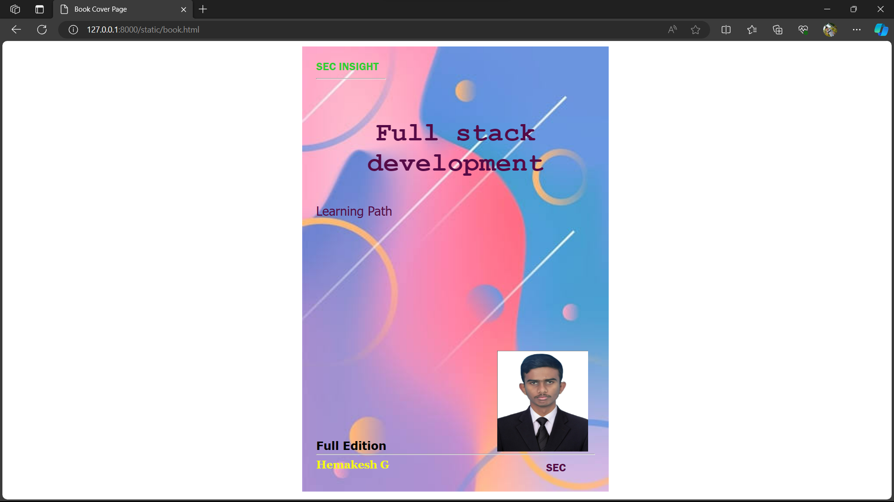

# Ex.06 Book Front Cover Page Design
## Date:29.11.23

## AIM:
To design a book front cover page using HTML and CSS.

## DESIGN STEPS:

### Step 1:
Create a Django Admin project.

### Step 2:
Create an app in the Django interface.

### Step 3:
Create a folder named 'static' in the app folder.

### Step 4:
Create a new HTML file in the static folder.

### Step 5:
Write the HTML code with relevant CSS properties.

### Step 6:
Choose the appropriate style and color scheme.

### Step 7:
Insert the images in their appropriate places.

### Step 8:
Publish the website in the LocalHost.

## PROGRAM:
```
<html>
    <head>
        <meta name="viewport"
        content="width=device-width, initial-scale=1.0">
        <style>
            .bookpage{
                width: 400px;
                height: 600px;
                color: rgb(85, 10, 70);
                margin-left: auto;
                margin-right: auto;
                padding: 20px;
                font-family:'Franklin Gothic Medium', 'Playfair Display', Arial, Helvetica, sans-serif;
                background-image: url("back.jpg");
                background-size: cover;
            }
            .insight{
                color: limegreen;

            }
            .hrstyle{
                width: 100px;
            }
            .author{
                display: inline;
                position: relative;
                color: rgb(245, 253, 9);
                top: 260px;

                font-family: Georgia;
                font-size: medium;
            }
            .booktitle{
                font-family: 'Courier New', Courier, monospace;
                font-size: larger;
                text-align: center;
                position: relative;
                top: 30px;

            
            }
            .id{
                width: 400px;
                position: relative;
                top: 270px;

            }
            .pub{
                font-size: medium;
                position: relative;
                top: 230px;
                left: 330px;
            }
            .ed{
                color: black;
                font-size: medium;
                font-family: Verdana;
                position: relative;
                top: 180px;

            }
            .subtitle{
                font-family: 'Tahoma';
                font-size: large;
                position: relative;
                top: 40px;
            }
            .mypic{
                position: relative;
                top: 230px;
                left: 260px;
                width: 100px;
                height: 100px;
                background-size: cover;
            }
        </style>
        <title>Book Cover Page</title>

    </head>
    <body>
        <div class="bookpage">
            <div class="insight">
                SEC INSIGHT
            </div>
            <div class="hrstyle">
                <hr style="color: yellow;">
            </div>
            <div class="booktitle">
                <h1>Full stack development</h1>
            </div>
            <div class="subtitle">
                Learning Path
            </div>
            <div class="mypic">
                
            </div>
            <div class="id">
                <hr style="color: orange;">
            </div>
            <div class="author">
                <p><b>Hemakesh G</b></p>
            </div>
            <div class="pub">
                SEC
            </div>
            <div class="ed">
                <b>Full Edition</b>
            </div>
        </div>

    </body>
</html>

```


## OUTPUT:



## RESULT:
The program for designing book front cover page using HTML and CSS is completed successfully.
